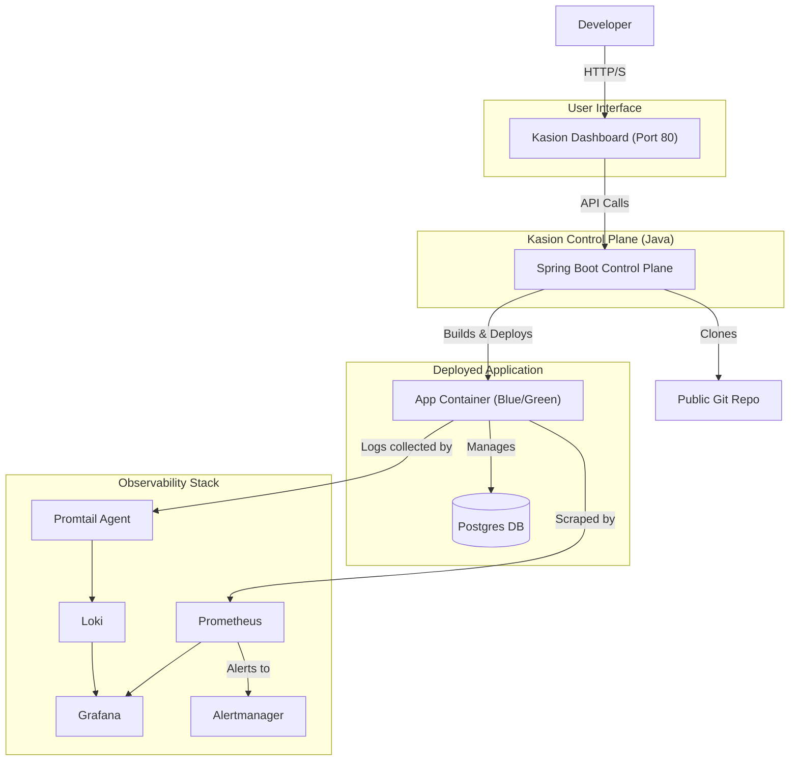

# Kasion Platform

> The open-source, self-hosted Platform-as-a-Service (PaaS) for Java developers.  
> Deploy and manage Spring Boot & Gradle applications on your own infrastructure with the simplicity of Heroku and the power of a modern observability stack.

[](https://github.com/lawrencedcodes/kasion-platform)
[](https://github.com/lawrencedcodes/kasion-platform)
[](https://github.com/lawrencedcodes/kasion-platform/blob/main/LICENSE)

---

## Overview

Kasion is a Java-native control plane that bridges the gap between expensive, managed PaaS solutions and the overwhelming complexity of Kubernetes. It provides a "Git-push-to-deploy" workflow on your own low-cost VPS, giving you full control over your infrastructure without the DevOps overhead.

Designed by and for Java developers, Kasion deeply understands the applications it manages, providing automated builds, deployments, and advanced, Java-centric observability and diagnostic tools right out of the box.

## Key Features

Kasion is more than just a deployment script; it's a complete ecosystem for running modern Java applications.

#### 🚀 Deployment & Runtime
*   **Zero-Configuration Builds:** Paste a public GitHub URL and Kasion handles the rest.
*   **Multi-Build System Support:** Automatically detects and builds both **Maven (`mvnw`)** and **Gradle (`gradlew`)** projects.
*   **Zero-Downtime Deployments:** Utilizes a blue-green deployment strategy with active health checks to ensure seamless updates.
*   **Opinionated, Optimized Runtimes:**
    *   **Layered JAR Support:** Automatically creates optimized Docker images using Spring Boot's layered JARs for dramatically faster builds.
    *   **Automatic JVM Tuning:** Sets optimal JVM memory flags (`-XX:MaxRAMPercentage`) to ensure your application runs reliably within its container.
    *   **Multi-Version Java Support:** Easily configure the Java version (11, 17, 21, etc.) for your project.
*   **Managed Databases:** Automatically provisions a dedicated **Postgres** database for your application on request, injecting credentials with zero manual setup.

####  observability Suite (The "LOG-M" Stack)
*   **Centralized Logging (Loki):** All application and system logs are automatically collected, indexed, and made searchable.
*   **Rich Metrics (Prometheus):** A full suite of application and JVM metrics are collected via Spring Boot Actuator and a JMX Exporter, providing deep historical insight.
*   **Integrated Visualization (Grafana):** Kasion ships with a pre-configured Grafana instance, automatically providing a beautiful dashboard for every application to visualize logs and metrics together.
*   **Proactive Alerting (Alertmanager):** Comes with a default set of alerts for common problems like high CPU usage or application downtime.

#### ⚙️ Advanced Java Tooling
*   **JMX Console:** A secure, web-based JMX console allows for deep inspection and interaction with the running JVM.
*   **Thread Dump Analysis:** Generate and view a full thread dump from your application with a single click to diagnose deadlocks and performance issues.

#### 🔒 Security
*   **Unified Authentication:** The entire Kasion platform (dashboard, Grafana, Prometheus, etc.) is protected by a single, unified HTTP Basic authentication layer.
*   **Secure by Default:** All management UIs are isolated from the public internet and accessed securely through a reverse proxy.

---

## Architecture

Kasion runs as a meta-application on a single host, orchestrating your applications alongside a complete observability stack using Docker.



---

## 🚦 Getting Started

Getting Kasion up and running is designed to be as simple as possible.

### Prerequisites
*   A Linux-based host (or WSL2) with Docker, Java 21+, and Git installed.
*   A public IP address for your host.

### Installation

1.  **Clone the Repository:**
    ```bash
    git clone https://github.com/lawrencedcodes/kasion-platform.git
    cd kasion-platform
    ```

2.  **Run the Automated Setup:**
    We provide a script to handle all initial configuration.
    ```bash
    ./setup.sh
    ```
    This script will create the necessary Docker network and download the required Java agents.

3.  **Start the Platform:**
    Navigate to the `control-plane` directory and start the Docker Compose stack.
    ```bash
    cd control-plane
    docker-compose up -d
    ```

4.  **Log In and Deploy:**
    *   On the first run, the admin credentials will be printed to the console. **Save this password!**
    *   Access the dashboard at `http://<your-host-ip>`. Log in with the provided credentials.
    *   Click "New Project" and deploy your first application!

For a more detailed walkthrough, please see our [SETUP.md](SETUP.md) guide.

---

## Usage

Once deployed, you can access all of Kasion's features through the main dashboard.

*   **Grafana Dashboard:** `http://<your-host-ip>/grafana/`
*   **Prometheus UI:** `http://<your-host-ip>/prometheus/`
*   **JMX Console:** Navigate to your project on the Kasion dashboard and click the "JMX" button.

---

## 🤝 Contributing

We welcome contributions of all kinds, from bug fixes to new feature proposals. Please see our [CONTRIBUTING.md](CONTRIBUTING.md) guide to get started.

## 📄 License

Kasion is open source and licensed under the MIT License.